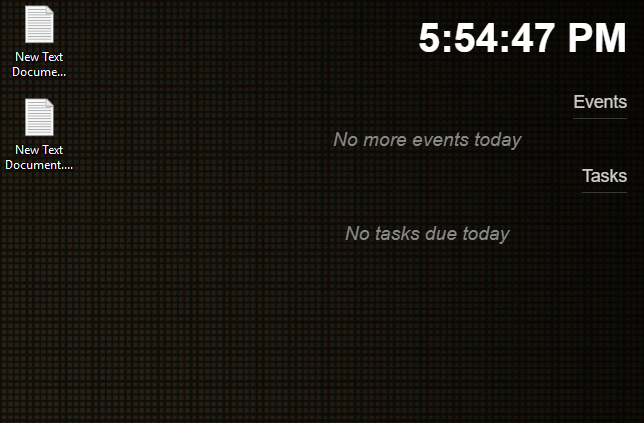
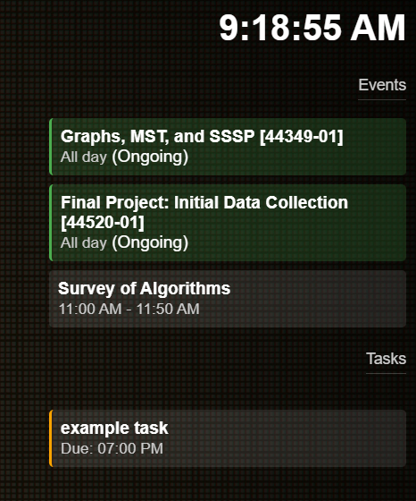

# SecondMonitor
Purpose:
- Display a calendar on a secondary monitor
- Display tasks due today (from Google Calendar)
- Display the current time (Completely unnecessary, but I like it)

## Summary
A desktop calendar application that displays your Google Calendar events and tasks on your secondary monitor.
### Example rendering:

## Setup

1. Clone this repository
2. Run `npm install`
3. Set up Google Calendar API

### Google Calendar Setup
1. Go to [Google Cloud Console](https://console.cloud.google.com/)
2. Create a new project
3. Enable the following APIs:
   - Google Calendar API
   - Google Tasks API
4. Create OAuth 2.0 credentials:
   - Go to Credentials
   - Click "Create Credentials" > "OAuth client ID"
   - Choose "Desktop application"
   - Download the credentials
5. Rename the downloaded file to `credentials.json` and place it in the project root

### Running the App
1. Run `npm run auth` to authenticate with your Google account
2. Run `npm start` to start the application in development mode
   
### Building the App
1. Run `npm run dist` as administrator
2. Find the installer in the `dist` folder
3. Run the installer

# Final Notes
 - I have no idea what I'm doing, so this is probably a terrible way to do this.
 - There may or may not be security issues with this.
 - I'm sure there are some bugs.
 - I know there are some UI issues.
 - I'm sure there are some performance issues.
 - I'm sure there are some code issues.
 - It works on my machine, so good luck!
 
 If you can't tell, I'm still learning. If you know what you're doing, please feel free to make any changes you want and let me know what I did wrong so I can git gud.
